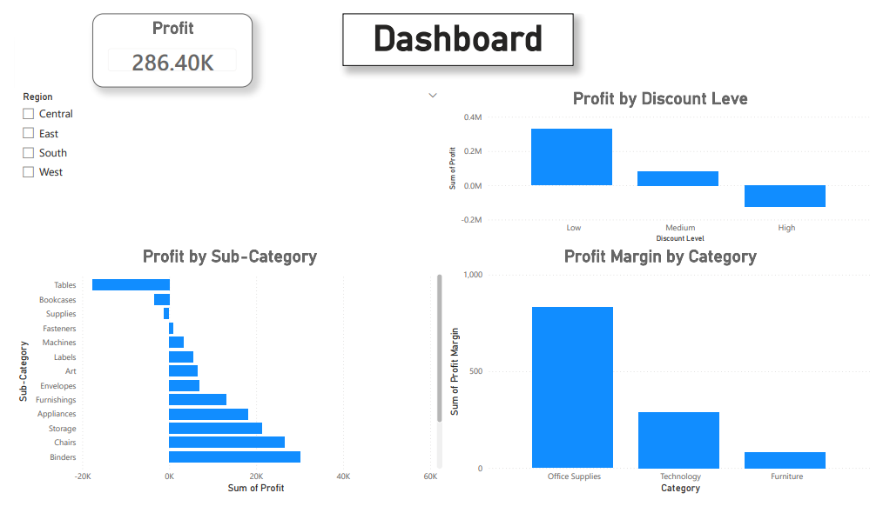

# 📊 Profitability Drivers Analysis (Superstore Dataset)

## 🔍 Project Overview
This project analyzes the key drivers of profit and loss using the Superstore dataset.
The goal is to understand how discounts, product categories, and sub-categories impact overall profitability.

The project combines **SQL, Python, and Power BI** to demonstrate an end-to-end data analysis workflow.

---

## 🛠 Tools & Technologies
- Python (Pandas, Matplotlib)
- SQL
- Power BI
- Git & GitHub

---

## 📁 Project Structure

---

## 📈 Key Analysis Steps

### 1️⃣ Feature Engineering (Python)
- Calculated **Profit Margin**
- Created **Discount Levels** (Low / Medium / High)

### 2️⃣ Loss Drivers Analysis
- Identified top **loss-making sub-categories**
- Found that high discounts are strongly correlated with negative profit

### 3️⃣ Profitability Insights
- Technology category shows the highest profit margin
- Furniture category has low margins and high losses
- High discount levels consistently lead to losses

---

## 📊 Power BI Dashboard
The dashboard highlights:
- Total Profit KPI
- Profit by Discount Level
- Profit by Sub-Category
- Profit Margin by Category
- Interactive filters by Region

---

## 🚀 Key Takeaways
- Discounts should be carefully controlled to avoid losses
- Not all high-sales sub-categories are profitable
- Profit margin is a better metric than total sales alone

---

## 📊 Power BI Dashboard

---

## 👤 Author
**Mostafa Mahereid**  
Aspiring Data Analyst | Python | SQL | Power BI

